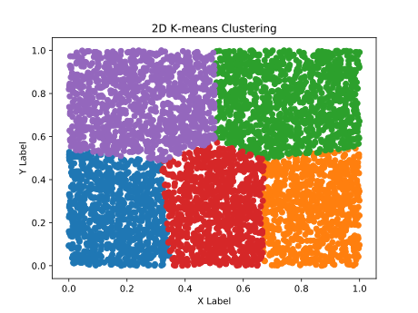
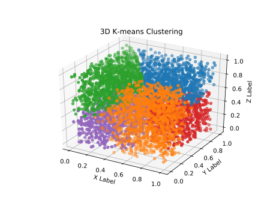

# _k_-means clustering

Implementation of _k_-means clustering algorithm.

## Installing requirements
```bash
pip install -r requirements.txt
```

## Running
You need to have Python 3 installed.
```bash
python3 main.py
```


## Results

### Two dimensional example

* **_N_**: 5000
* **_k_**: 5



### Three dimensional example
* **_N_**: 5000
* **_k_**: 5

